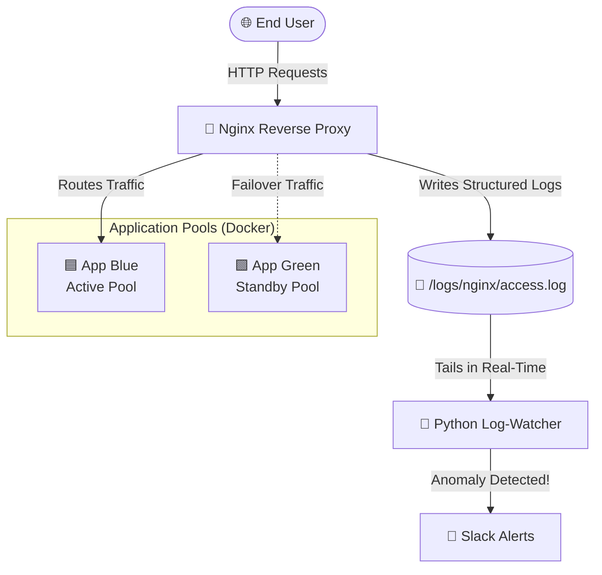

# 🚀 Stage 2 & 3 DevOps: Blue/Green Deployment with Observability & Slack Alerts

Welcome to this **Technical Case Study** exploring High Availability (HA) deployments, Observability, and automated alerting. This project demonstrates a production-grade infrastructure setup utilizing Nginx as a Reverse Proxy, Docker Compose, and a custom Python Log-Watcher to ensure system reliability and seamless failovers.

---

## 🎯 The Problem: Why Blue/Green Deployment?

In traditional software deployments, releasing a new version often requires stopping the old application before starting the new one. This leads to **Downtime**, which is unacceptable for mission-critical applications. 

**Blue/Green Deployment** solves this by running two identical production environments (Pool Blue and Pool Green). 
- Only one environment is live at any given time serving all production traffic.
- When deploying a new release, we deploy it to the inactive environment.
- Once tested and verified, we instantly flip the traffic switch at the load balancer (Nginx) level.
- **Result:** Zero-Downtime Deployments, instant rollbacks, and a safety net for unexpected crashes.

---

## 🏗️ Technical Architecture

This repository simulates a highly available application with built-in observability. Here's how the different pieces connect:



### How It Works:
1. **The Reverse Proxy (Nginx):** Acts as the entry point, routing traffic to the currently active application pool. It generates structured logs containing crucial metrics like `upstream_status`, `request_time`, and `pool`.
2. **The Observability Layer (Python Watcher):** A standalone Python daemon continuously tails the Nginx logs. It relies on a sliding window approach rather than absolute counts to dynamically detect anomalies.
3. **The Alerting Mechanism:** If the watcher detects a traffic failover or a spike in 5xx errors (e.g., crossing a 2% threshold), it instantly fires a structured notification to a designated Slack channel, allowing on-call engineers to react swiftly.

---

## 🚦 Getting Started (Step-by-Step)

Want to see it in action? Follow these steps, perfectly structured for beginners:

### 1. Clone & Prepare
```bash
# Clone the repository
git clone https://github.com/moriadim/stage2-devops.git
cd stage2-devops

# Set up your environment variables
cp .env.example .env
```
*💡 Make sure to edit `.env` and add your `SLACK_WEBHOOK_URL`.*

### 2. Spin Up the Infrastructure
```bash
# We added a smart Makefile to make your life easier! Give it a try:
make up
```

### 3. Unleash the Chaos! 😈
Time to test the Blue/Green failover mechanism by simulating an application crash.
```bash
# Start injecting errors to force a failover
make chaos
```

### 4. Monitor the Action
```bash
# Watch the Nginx routing logs and the Python watcher simultaneously
make logs
```
Watch your terminal for live logs and check your Slack for an alert:
🚨 *Failover Detected - pool changed from blue → green!*

### 5. Clean Up
```bash
# Wipe out all containers, volumes, and logs to start fresh
make clean
```

---

## 🧠 Key Learnings

Building this case study was a fantastic deep dive into modern SRE practices. Here is what I learned:

1. **The Art of Log Parsing (Regex):** Parsing plain text logs efficiently using Regex in Python taught me how to extract structured, actionable data (`Key=Value` pairs) out of unstructured streams.
2. **Balancing Alert Thresholds:** Initially, raw error counts created a lot of "noise." By implementing a **sliding window** with a percentage threshold (e.g., 2% errors over the last 200 requests) and adding **cooldown periods**, I learned how to combat "Alert Fatigue" for on-call engineers.
3. **Graceful Degradation:** Realizing that failures *will* happen, and designing a system (Blue/Green + Nginx upstream) that handles these failures seamlessly without dropping the user's connection.

---

*This repository is designed to be a sandbox for learning High Availability and Monitoring. Feel free to break things, observe how the system reacts, and level up your SRE skills!*